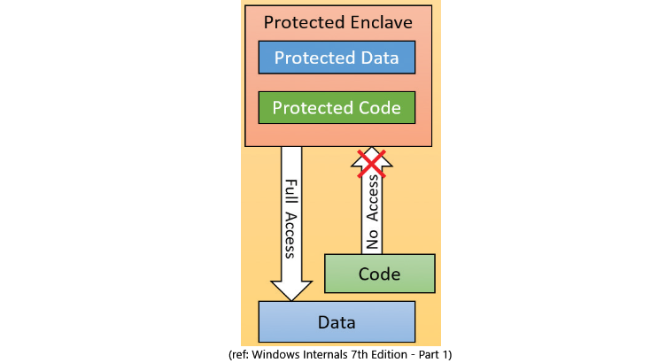

# Memory Enclave Leads to Crash

## Introduction
This document is published because Microsoft said that is NOT a security bug. (!!!) So, I published this document only for educational purpose.

A few months ago, I’ve played with `Memory Enclaves` in win10.

> Memory enclaves are secure zones in a process address space where code and data are protected by the CPU from code running outside the enclave. Conversely, code running inside an enclave has full (normal) access to process address space outside the enclave. Naturally, the protection extends to access from other processes and even code running in kernel mode.
>
> Windows Internals 7th Edition – Part 1

Firstly, this feature implemented by Intel SGX. Starting with Windows 10 version 1511, some APIs are introduced.
In this case, I’ve worked with the latter and used these APIs:

* `IsEnclaveTypeSupported` to check you could use this feature or not
* `OpenProcess` to get handle to current process
* `CreateEnclave` to create a zone
* `InitializeEnclave` to init the created zone

To be honest, I did not do any reverse engineering or fuzzing or … to get this crash. MSDN Helped me! 🙂 You may ask How?
I had a plan to create a secure zone for fun to write my arbitrary buffer to and read from it. So, I decided to use Memory Envcalves.
Unfortunately (or in our case, fortunately), Microsoft documentation for memory enclaves is not enough and has some problems. So, I had to keep my work by search and trial and error.
This is the story about how I got the crash.

## Scenario
* Update your Windows 10 Enterprise x64 (Tested on Windows 10 x64 – Version 21H2 – OS Build 19044.1645)
* Enable VBS (Virtualization-based Security)
* Compile the code for x64 arch in debug or release mode and run it
* You’ll get BSOD (APC_INDEX_MISMATCH)

# Demo
https://youtu.be/Qd5hMPuVF7U

## Timeleine
### 10-02-2022
I reported the bug via MSRC with Submission number VULN-061938 and Case number 70209.

### 10-02-2022
Microsoft said that is not a security bug.

### 10-02-2022
I published this document.

